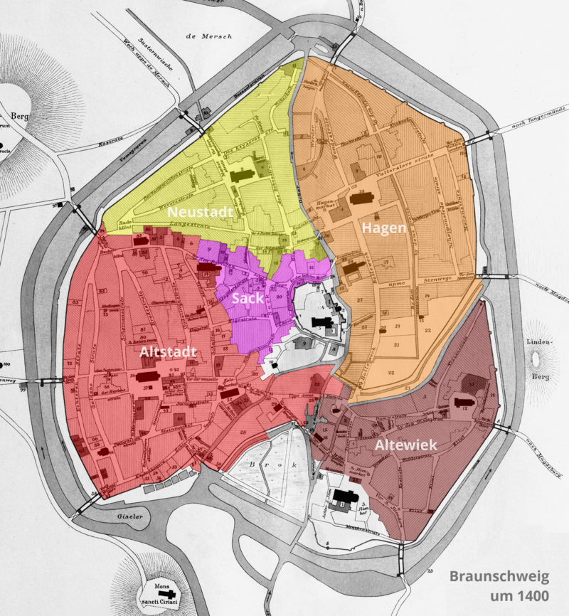

奥克河是德国下萨克森州一条一百多公里的河，自德国中部的哈尔茨山起，自南向北流。尽管不算很长，但对城市布伦瑞克来说，却是最最重要的一条河。

下图中可以看到，Oker河在布伦瑞克的部分呈一个环形，其形因其实半是自然半是人工。Oker河的布伦瑞克段原本多分支，密布成网状，形成很多河岛，那时的布伦瑞克是一个沼泽洪泛区，人们只能在海拔高于七十米的地方分别建立一些城堡、修道院和居民区[^1]。

[^1]: <https://de.wikipedia.org/wiki/Geschichte_der_Oker_in_Braunschweig>

```{r, oker, echo=F,fig.show="hold",fig.cap="布伦瑞克奥克河"}
knitr::include_graphics("images/OkerInBS96dpi.jpg")
```

在十二世纪时德意志著名王公狮子亨利把布伦瑞克作为他的首府，很是做了一番城市建设，加固了五个市区（Weichbild）[^2]的城墙、护城河，改掉旧河道，挖出新河道。当时，Hagen区的水由弗里斯兰移民排出，现在的Friesenstraße由此得名。于是到十三世纪，布伦瑞克的内城已经形成了现在的样子。

[^2]: <https://zh.wikipedia.org/wiki/%E4%B8%8D%E4%BC%A6%E7%91%9E%E5%85%8B#%E7%8B%AE%E5%AD%90%E4%BA%A8%E5%88%A9%E6%97%B6%E6%9C%9F>

有趣的是我们可以看出河流的分割对人类聚集地的影响。布伦瑞克1400年的五个市区各有自己的市政府和教堂，是相对独立的区块，而五个分区的分界往往就是奥克河。

```{r, figures-side, fig.show="hold",echo=FALSE,out.width="50%",fig.cap="布伦瑞克公元1400年的奥克河道和五个市区[^3]"}
knitr::include_graphics("images/800px-Braunschweig_1400_Okerverlauf.jpg")

```
[^3]:https://de.wikipedia.org/wiki/Weichbild
